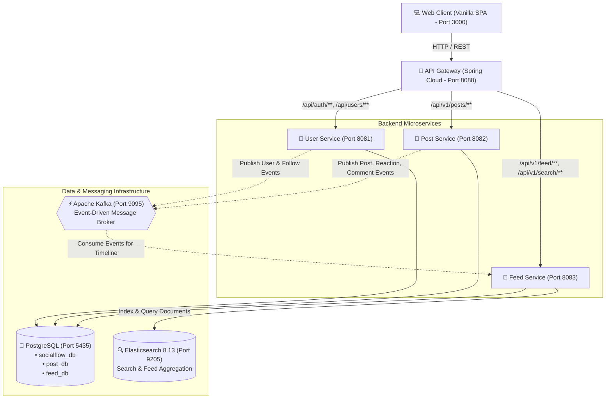

# 🌊 SocialFlow — Distributed Social Network Platform

[](https://www.oracle.com/java/)
[](https://spring.io/projects/spring-boot)
[](https://spring.io/projects/spring-cloud-gateway)
[](https://kafka.apache.org/)
[](https://www.elastic.co/)
[](https://www.postgresql.org/)
[](https://www.docker.com/)

**SocialFlow** is an enterprise-grade, event-driven distributed microservices social network platform. Designed for scalability, high availability, and real-time performance, SocialFlow leverages **Spring Boot 3**, **Spring Cloud Gateway**, **Apache Kafka (KRaft mode)**, **Elasticsearch**, **PostgreSQL**, and a modern, responsive web client.

---

## 📑 Table of Contents
- [Architecture Overview](#-architecture-overview)
- [Microservices Breakdown](#-microservices-breakdown)
- [Key Features](#-key-features)
- [Event-Driven Architecture (Kafka)](#-event-driven-architecture-kafka)
- [Port Mapping & Services](#-port-mapping--services)
- [REST API Endpoints](#-rest-api-endpoints)
- [Getting Started & Installation](#-getting-started--installation)
  - [Prerequisites](#prerequisites)
  - [Option A: One-Click Docker Launch](#option-a-one-click-docker-launch-recommended)
  - [Option B: Manual Docker Compose](#option-b-manual-docker-compose)
  - [Option C: Local Development Build](#option-c-local-development-build)
- [Project Directory Structure](#-project-directory-structure)
- [Author & License](#-author--license)

---

## 🏛 Architecture Overview

SocialFlow adopts a decoupled microservices pattern where each domain is encapsulated within an autonomous service with its own isolated database schema (Database-per-Service pattern). Asynchronous communication and event propagation occur through Apache Kafka, and search and feed retrieval are accelerated by Elasticsearch.



---

## 🧩 Microservices Breakdown

| Service | Technology | Port | Responsibilities |
| :--- | :--- | :--- | :--- |
| **`api-gateway`** | Spring Cloud Gateway (Netty) | `8088` | Unified entry point, intelligent routing, CORS handling, non-blocking asynchronous request dispatching. |
| **`user-service`** | Spring Boot 3, Spring Security, JWT, JPA | `8081` | Authentication & authorization (JWT), registration, login, user profiles, following/unfollowing relationships. |
| **`post-service`** | Spring Boot 3, Spring Data JPA, Kafka | `8082` | Post creation, multimedia attachments, interactive polls with real-time voting, reposts/quotes, 6 reaction types, comments, bookmarks, and pinned posts. |
| **`feed-service`** | Spring Boot 3, Spring Data Elasticsearch, JPA | `8083` | Aggregated timeline feeds ("For You", "Following", "Trending"), trending hashtags calculation, full-text search engine with keyword and hashtag indexing. |
| **`media-service`** | Spring Boot 3, AWS S3 SDK v2, MinIO | `8084` | S3-compatible media upload service, presigned URL generation, bucket auto-provisioning, and secure public assets delivery. |
| **`frontend`** | HTML5, Vanilla JavaScript, CSS3, Nginx | `3000` | Modern, responsive social feed UI with dark mode, glassmorphism, dynamic modals, live reactions, RTL support, and tab switching. |

---

## 🌟 Key Features

- **🔐 Robust Authentication & Security**: Stateless JWT-based authentication with bcrypt password hashing and granular endpoint protection.
- **📝 Rich Post Publishing**:
  - Regular text posts and rich content.
  - Interactive polls with multiple choices and instant percentage vote calculation.
  - Reposts and Quote Posts.
  - 6 distinct reaction types: `LIKE`, `LOVE`, `CELEBRATE`, `SUPPORT`, `INSIGHTFUL`, `FUNNY`.
  - Nested comments and discussions.
  - Post pinning to profile and personal bookmarks.
- **⚡ Smart Aggregated Feeds**:
  - **Following Feed**: Chronological stream of posts from creators the user follows.
  - **For You (Algorithmic) Feed**: Global engagement-weighted feed.
  - **Trending Feed**: Posts trending by high engagement velocity.
  - **Trending Hashtags**: Real-time aggregation of top hashtags across recent posts.
- **🔍 Full-Text Elasticsearch Search**: Blazing fast search across post contents and hashtags with fuzzy matching and pagination.
- **🐳 Full Containerization**: Ready-to-run multi-container setup with Docker Compose, volume persistence, and database auto-provisioning.

---

## ⚡ Event-Driven Architecture (Kafka)

Kafka operates in lightweight **KRaft mode** (without Zookeeper dependency) to stream domain events between services:
- **`user-events`**: Emitted when users follow/unfollow creators, synchronizing relation graphs into `feed-service`.
- **`post-events`**: Emitted when a new post is published or deleted, triggering automatic indexing into Elasticsearch.
- **`reaction-events`**: Emitted when reactions and likes occur, updating engagement scores for the trending algorithm.

---

## 🌐 Port Mapping & Services

| Container Name | Service | Internal Port | Host Port |
| :--- | :--- | :--- | :--- |
| `socialflow-frontend` | Web UI | `80` | `3000` |
| `socialflow-api-gateway` | API Gateway | `8088` | `8088` |
| `socialflow-user-service` | User & Auth Service | `8081` | `8081` |
| `socialflow-post-service` | Post Service | `8082` | `8082` |
| `socialflow-feed-service` | Feed & Search Service | `8083` | `8083` |
| `socialflow-media-service`| Media & Upload Service | `8084` | `8084` |
| `socialflow-minio`        | MinIO Object Storage (S3) | `9000` / `9001` | `9000` / `9001` |
| `socialflow-postgres` | PostgreSQL Database | `5432` | `5435` |
| `socialflow-kafka` | Apache Kafka Broker | `9092` / `29092` | `9095` |
| `socialflow-elasticsearch`| Elasticsearch Search Engine | `9200` | `9205` |

---

## 🔌 REST API Endpoints

All client requests should be directed through the **API Gateway** (`http://localhost:8088`).

### 1. Authentication & Users
| Method | Endpoint | Description | Auth Required |
| :--- | :--- | :--- | :---: |
| `POST` | `/api/auth/register` | Register a new user | ❌ |
| `POST` | `/api/auth/login` | Log in and receive JWT token | ❌ |
| `GET` | `/api/users/profile/{username}` | Fetch user profile and statistics | Optional |
| `POST` | `/api/users/{userId}/follow` | Follow a user | ✅ |
| `DELETE` | `/api/users/{userId}/unfollow` | Unfollow a user | ✅ |
| `GET` | `/api/users/{userId}/following-ids` | List IDs of followed users | ❌ |

### 2. Posts & Interactions
| Method | Endpoint | Description | Auth Required |
| :--- | :--- | :--- | :---: |
| `POST` | `/api/v1/posts` | Create a post (text, poll, attachment) | ✅ |
| `GET` | `/api/v1/posts/{id}` | Get post by ID | Optional |
| `DELETE` | `/api/v1/posts/{id}` | Delete post | ✅ |
| `POST` | `/api/v1/posts/{id}/like` | Toggle post like | ✅ |
| `POST` | `/api/v1/posts/{id}/reactions` | Add/update reaction (LIKE, LOVE, etc.) | ✅ |
| `GET` | `/api/v1/posts/{id}/reactions/summary` | Get aggregated reaction counts | Optional |
| `POST` | `/api/v1/posts/{id}/comments` | Add comment to post | ✅ |
| `GET` | `/api/v1/posts/{id}/comments` | Fetch post comments | ❌ |
| `POST` | `/api/v1/posts/{id}/repost` | Repost or Quote a post | ✅ |
| `POST` | `/api/v1/posts/{id}/poll/vote` | Vote on a poll option | ✅ |
| `POST` | `/api/v1/posts/{id}/bookmark` | Toggle bookmark on post | ✅ |
| `GET` | `/api/v1/posts/bookmarks` | Get current user's bookmarks | ✅ |
| `PUT` | `/api/v1/posts/{id}/pin` | Pin/unpin post to profile | ✅ |

### 3. Feeds & Search
| Method | Endpoint | Description | Auth Required |
| :--- | :--- | :--- | :---: |
| `GET` | `/api/v1/feed/for-you` | Algorithmic global discovery feed | ❌ |
| `GET` | `/api/v1/feed/following` | Personalized feed from followed users | ❌ |
| `GET` | `/api/v1/feed/trending` | High-engagement trending feed | ❌ |
| `GET` | `/api/v1/feed/trending-tags` | List trending hashtags with post counts | ❌ |
| `GET` | `/api/v1/search?q={query}` | Search posts via Elasticsearch | ❌ |
| `GET` | `/api/v1/search/tag/{tag}` | Filter posts by hashtag | ❌ |

---

## 🚀 Getting Started & Installation

### Prerequisites
- [Docker & Docker Desktop](https://www.docker.com/products/docker-desktop/) (v24+)
- [Java 17 JDK](https://adoptium.net/) (for local development/build)
- [Apache Maven 3.9+](https://maven.apache.org/) (optional, if running without Docker)

### Option A: One-Click Docker Launch (Recommended)
On Windows, you can launch the entire stack with a single PowerShell script:
```powershell
.\start_docker.ps1
```
This script terminates any lingering local port conflicts, boots all 7 Docker containers in detached mode, and displays health status.

To stop all containers:
```powershell
.\stop_docker.ps1
```

### Option B: Manual Docker Compose
```bash
# 1. Build and start all services in the background
docker compose up -d --build

# 2. View running containers
docker compose ps

# 3. Stream logs
docker compose logs -f
```

Once up, access the platform:
- **Web App**: [http://localhost:3000](http://localhost:3000)
- **API Gateway**: [http://localhost:8088](http://localhost:8088)

### Option C: Local Development Build
To compile and test all microservices locally with Maven:
```bash
# Compile and package all services
mvn clean install -DskipTests
```

---

## 📁 Project Directory Structure

```text
socialflow/
├── .gitignore                   # Git ignore patterns for Maven, IDEs, OS
├── README.md                    # Comprehensive documentation
├── docker-compose.yml           # Multi-container orchestration definition
├── init-db.sql                  # Automated PostgreSQL database initialization
├── pom.xml                      # Parent Maven POM aggregating all modules
├── start_docker.ps1             # Automated launch script for Docker stack
├── stop_docker.ps1              # Automated shutdown script
├── start_frontend.ps1           # Standalone local frontend launcher
│
├── api-gateway/                 # Spring Cloud Gateway Service (Port 8088)
│   ├── pom.xml
│   ├── Dockerfile
│   └── src/main/resources/application.yaml
│
├── user-service/                # User & JWT Authentication Service (Port 8081)
│   ├── pom.xml
│   ├── Dockerfile
│   └── src/main/java/com/socialflow/user/...
│
├── post-service/                # Posts, Reactions, Polls & Comments Service (Port 8082)
│   ├── pom.xml
│   ├── Dockerfile
│   └── src/main/java/com/socialflow/post/...
│
├── feed-service/                # Elasticsearch Timeline & Search Service (Port 8083)
│   ├── pom.xml
│   ├── Dockerfile
│   └── src/main/java/com/socialflow/feed/...
│
└── frontend/                    # Responsive Web Client (Port 3000)
    ├── Dockerfile
    ├── nginx.conf
    ├── index.html
    ├── index.css
    └── app.js
```

---

## 👨‍💻 Author & License

Developed with ❤️ by **[Idan Kazam](https://github.com/IDAN2468D)**.

This project is licensed under the MIT License — feel free to use, modify, and distribute.
